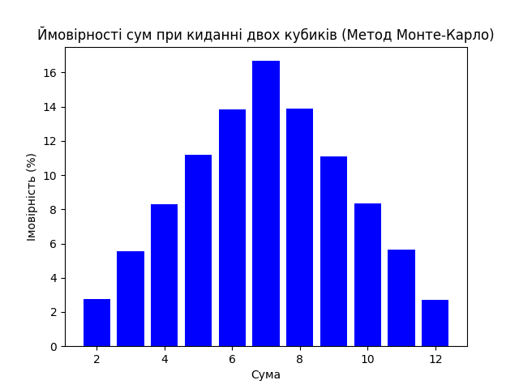

# Висновки
Порівняння результатів, отриманих за допомогою методу Монте-Карло, з аналітичними розрахунками показує, що вони дуже близькі. Це підтверджує правильність реалізації симуляції. Розглянемо детальніше кожну суму:

| Сума | Імовірність (Монте-Карло) | Імовірність (Аналітична) |
|------|---------------------------|--------------------------|
| 2    | 2.75%                     | 2.78%                    |
| 3    | 5.57%                     | 5.56%                    |
| 4    | 8.28%                     | 8.33%                    |
| 5    | 11.17%                    | 11.11%                   |
| 6    | 13.86%                    | 13.89%                   |
| 7    | 16.67%                    | 16.67%                   |
| 8    | 13.87%                    | 13.89%                   |
| 9    | 11.11%                    | 11.11%                   |
| 10   | 8.33%                     | 8.33%                    |
| 11   | 5.66%                     | 5.56%                    |
| 12   | 2.72%                     | 2.78%                    |

Як видно з таблиці, відхилення між результатами методу Монте-Карло та аналітичними розрахунками є мінімальними. Найбільше відхилення становить лише 0.06% для суми 11, що є дуже малим і не впливає на загальну картину.

Таким чином, можна зробити висновок, що метод Монте-Карло є ефективним для моделювання ймовірностей сум при киданні двох кубиків. Отримані результати підтверджують теоретичні розрахунки, що свідчить про правильність реалізації алгоритму симуляції.

